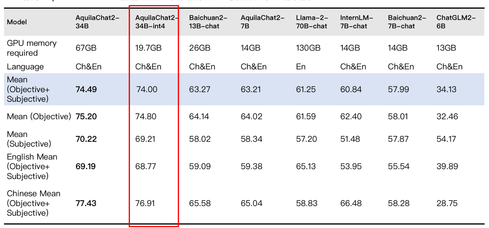

<p align="left">
    <a href="README_CN.md">中文</a>&nbsp ｜ &nbspEnglish&nbsp
</p>
<br><br>

<p align="center">
    
<p>
<br>

<p align="center">
        🤗 <a href="https://huggingface.co/BAAI">Hugging Face</a>&nbsp&nbsp | &nbsp&nbsp <a href="https://model.baai.ac.cn/models"> BAAI ModelHub</a>&nbsp&nbsp | &nbsp&nbsp <a href="assets/wechat-qrcode.jpg">WeChat(微信)</a>
</p>
<br>

We announce that our **Aquila2** series is now open source, comprising Aquila2 (the base language models: **Aquila2-7B** and **Aquila2-34B**) and AquilaChat2 (the chat models, namely **AquilaChat2-7B** and **AquilaChat2-34B**, as well as the long-text chat models, namely **AquilaChat2-7B-16k** and **AquilaChat2-34B-16k**). You can find the links in the following table. Kindly click on them to access the model cards.

| Model Name         | Download Sources  | 
|-------------------|:---------:|
| Aquila2-7B        | [](https://model.baai.ac.cn/model-detail/100118) [🤗](https://huggingface.co/BAAI/Aquila2-7B)|    -    | 
| AquilaChat2-7B    | [](https://model.baai.ac.cn/model-detail/100117) [🤗](https://huggingface.co/BAAI/AquilaChat2-7B)|    -    | 
| AquilaChat2-7B-16k    | [](https://model.baai.ac.cn/model-detail/100120) [🤗](https://huggingface.co/BAAI/AquilaChat2-7B-16K)|    -    | 
| Aquila2-34B       | [](https://model.baai.ac.cn/model-detail/100119) [🤗](https://huggingface.co/BAAI/AquilaChat2-34B)|    -    | 
| AquilaChat2-34B   | [](https://model.baai.ac.cn/model-detail/100116) [🤗](https://huggingface.co/BAAI/AquilaChat2-34B)|    -    |
| AquilaChat2-34B-16k    | [](https://model.baai.ac.cn/model-detail/100121) [🤗](https://huggingface.co/BAAI/AquilaChat2-34B-16K)|    -    |

In this repo, you can figure out:

* Quickstart with Aquila2.
* Tutorials on finetuning, including full-parameter, LoRA, and Q-LoRA.
* Long-context understanding and evaluation
* License agreement

Please don't hesitate to bring up issues and feel free to submit pull requests (PRs) at any time (p.s. better in English for wider comprehension) – we're always enthusiastic about contributions!
<br><br>

## News and Updates

* 2023.10.25 🔥 Version 1.2 of **Aquila2-34B** 和 **AquilaChat2-34B** has been released on ModelHub and Hugging Face. The base model achieved an objective evaluation improvement of 6.9%. Aquila2-34B v1.2 demonstrated evaluation results on various examination, comprehension, and reasoning datasets, such as MMLU, TruthfulQA, CSL, TNEWS, OCNLI, and BUSTM, with respective increments of 12%, 14%, 11%, 12%, 28%, and 18%. In the subjective evaluation of 8 secondary ability dimensions, the Chat model reached or surpassed the level of GPT3.5. Compared to the V1 version, AquilaChat2-34B-16K-V1.2 demonstrates a significant improvement in its ability to handle long texts, approaching the level of GPT-3.5-16K.

* 2023.10.12 🔥 We release **Aquila2** series on BAAI ModelHub and Hugging Face.
<br><br>

## Performance

Aquila2 series outperforms the models of similar model sizes on a series of benchmark datasets. 

### Base Model Performance

<br>
<p align="center">
    
<p>
<br>
<p>
Note： We have discovered a data leakage problem with the GSM8K test data in the pre-training task dataset. Therefore, the evaluation results of GSM8K have been removed from the evaluation results.

Upon thorough investigation and analysis, it was found that the data leakage occurred in the mathematical dataset A (over 2 million samples), recommended by a team we have collaborated with multiple times. This dataset includes the untreated GSM8K test set (1319 samples). The team only performed routine de-duplication and quality checks but did not conduct an extra filtering check for the presence of the GSM8K test data, resulting in this oversight.

Our team has always strictly adhered to the principle that training data should not include test data. Taking this lesson from the error caused by not thoroughly checking the source of external data, we are currently investigating all 2 trillion tokens of data for various test datasets. So far, no test data such as MMLU and CMMLU have been found in the pre-training data.
</p>
<p>
    In evaluating generative chat models, our team prioritizes how models autonomously respond to questions—a reflection of real-world user interactions. Guided by Stanford University's HELM [1] approach, our assessment emphasizes context understanding and instruction adherence. In some cases, models may deliver answers not in line with the instruction of input, resulting in a "0" score. For instance, if the model should respond with "A" but outputs "B" or "The answer is A", it earns a "0."
    Other industry methods include concatenating "question+answer" and assessing the combined text's probability. However, in this method, the chat model doesn't generate content but computing probability scores. Due to its divergence from real-world chat scenarios, we haven't adopted this approach in our evaluations.
<br>
[1] https://crfm.stanford.edu/helm/latest/
</p>
	
<br>

### Long Context Performance

<br>

| Model                |   Method    | Avg. | EN-Avg. | ZH-Avg. | VCSUM(zh)<br>(Chinese) | LSHT(zh)<br>(Chinese) | HotpotQA<br>(English) | 2WikiMQA<br>(English) |
| :------------------- | :---------: | :--: | :-----: | :-----: | :--------------------: | :-------------------: | :-------------------: | :-------------------: |
| GPT-3.5-Turbo-16K   |      -      | 33.6 |  44.7   |  22.6   |          16.0          |         29.2          |         51.6          |         37.7          |
| **AquilaChat2-34B-16K** |  PI + SFT   | 32.8 |  44.1   |  21.5   |          16.5          |         26.5          |         47.4          |         40.8         |
| ChatGLM2-6B-32K     |  PI + SFT   | 30.8 |  39.6   |  22.0   |          16.2          |         27.7          |         45.1          |         34.0          |
| **AquilaChat2-7B-16K**  |  PI + SFT   | **29.5** | **31.7** | **27.2** |          **14.4**          |         **40.0**      |         **36.1**      |         **27.3**      |
| InternLM-7B-8K      |      -      | 22.4 |  30.6   |  14.3   |          13.0          |         15.5          |         33.3          |         27.9          |
| ChatGLM2-6B          |    None     | 22.1 |  26.6   |  17.6   |          14.6          |         20.5          |         33.0          |         20.2          |
| LongChat-7B-v1.5-32K |  PI + SFT   | 21.7 |  26.1   |  17.4   |          14.0          |         20.8          |         31.5          |         20.6          |
| Baichuan2-7B-Chat   |    None     | 21.3 |  25.9   |  16.8   |          13.6          |         20.0          |         32.8          |         18.9          |
| Internlm-20B-Chat   |    None     | 16.6 |  24.3   |   8.9   |          11.9          |          6.0          |         24.4          |         24.2          |
| Qwen-14B-Chat       | Dynamic NTK | 16.1 |  20.8   |  11.5   |          16.6          |          6.4          |         22.9          |         18.8          |
| XGen-7B-8K          |  Pre-train  | 16.0 |  21.3   |  10.8   |          1.5           |         20.0          |         14.2          |         28.3          |
| LLaMA2-7B-Chat-4K |    None     | 14.0 |  18.0   |  10.0   |          0.2           |         19.8          |         11.6          |         24.3          |
| Baichuan2-13B-Chat  |    None     | 10.5 |  14.8   |   6.3   |          7.0           |          5.5          |         16.0          |         13.6          |

<br>

### Reasoning Tasks Performance

<br>

| Model                        | Avg. | bAbI#16<br>(Inductive) | CLUTRR<br>(Inductive) | bAbI#15<br>(Deductive) | EntailmentBank<br>(Deductive) | αNLI<br>(Abductive) | E-Care<br>(Casual) |
| :--------------------------- | :--: | :--------------------: | :-------------------: | :--------------------: | :---------------------------: | :-----------------: | :----------------: |
| Baichuan2-7B-Chat            | 47.8 |          40.0          |         26.7          |          43.3          |             73.3              |        53.3         |        50.0        |
| Qwen-7B-Chat                 | 49.5 |          20.0          |         10.0          |          66.7          |             86.7              |        56.7         |        56.7        |
| Qwen-14B-Chat                | 51.1 |          26.7          |         10.0          |          63.3          |             86.7              |        63.3         |        56.7        |
| Baichuan2-13B-Chat           | 53.3 |          33.3          |         10.0          |          66.7          |             80.0              |        66.7         |        63.3        |
| InternLM-20B-Chat            | 53.9 |          46.7          |         13.3          |          43.3          |             80.0              |        70.0         |        70.0        |
| ChatGPT                      | 55.6 |          46.7          |          6.7          |          86.7          |             83.3              |        63.3         |        46.7        |
| LLaMA-70B-Chat               | 57.2 |          63.3          |         20.0          |          53.3          |             80.0              |        66.7         |        60.0        |
| GPT-4                        | 81.1 |          93.3          |         36.7          |         100.0          |             90.0              |        83.3         |        83.3        |
| **AquilaChat2-34B**         | **58.3** |          **43.3**          |         **16.7**      |          **63.6**          |             **80.0**          |        **80.0**     |        **66.7**        |
| **AquilaChat2-34B+SFT**     | **65.6** |          **73.3**          |         **16.7**      |          **76.7**          |             **80.0**          |        **76.7**     |        **70.0**        |
| **AquilaChat2-34B+SFT+CoT** | **69.4** |          **80.0**          |         **23.3**      |          **83.3**          |             **73.3**          |        **80.0**     |        **76.7**        |

<br>

## Requirements

* python 3.10 and above
* pytorch 1.12 and above, 2.0 and above are recommended
* transformers 4.32 and above
* CUDA 11.4 and above are recommended (this is for GPU users, flash-attention users, etc.)
<br><br>

## Quickstart
We have provided a straightforward example to illustrate how to quickly get started with Aquila2.

Before proceeding, ensure that your environment is properly configured and that the necessary packages have been installed. First and foremost, ensure that these prerequisites are met and then follow the instructions below to install the necessary libraries and dependencies.
```
pip install -r requirements.txt
```


If your device supports fp16 or bf16 precision, we also recommend installing flash-attention to enhance execution speed and reduce memory consumption. It's important to note that flash-attention is optional, and the project can be executed normally without it.

For the installation of flash-attention, please follow the instructions in https://github.com/Dao-AILab/flash-attention/.

### Using Docker Image
For the environment that meets these [requirements](https://docs.nvidia.com/deeplearning/frameworks/pytorch-release-notes/rel-23-06.html), you can also set up the environment required for Aquila2 by directly downloading [the Docker TAR file](https://model.baai.ac.cn/model-detail/220118), then loading and running it.
Because of all already installed dependencies, in the container you just pull all sources [FlagAI](https://github.com/FlagAI-Open/FlagAI.git) and [Aquila2](https://github.com/FlagAI-Open/Aquila2.git) and include both paths int environment variable, like export PYTHONPATH=$FLAGAI_HOME:$AQUILA2_HOME:$PYTHONPATH.

Now you can use  BAAI Modelhub or 🤗 Transformers to run our model。

###  ModelHub

You can now use the AquilaChat2-7B model for inference as follows:

```python
from flagai.auto_model.auto_loader import AutoLoader

# Model name
model_name = 'AquilaChat2-7B'
# model_name = 'AquilaChat2-34B'

# Load the model and tokenizer
autoloader = AutoLoader("aquila2", model_name=model_name)
# To modify the model loading path, use the model_dir parameter
# autoloader = AutoLoader("aquila2", model_dir='./checkpoints', model_name=model_name)
# To load the LoRA module, you need to provide the path to the LoRA module
# autoloader = AutoLoader("aquila2", model_name=model_name，lora_dir='./examples/checkpoints/lora/aquila2chat')
# To load the LoRA module, you need to provide the path to the LoRA module
# autoloader = AutoLoader("aquila2", model_name=model_name，qlora_dir='./examples/checkpoints/qlora/aquila2chat')

model = autoloader.get_model()
tokenizer = autoloader.get_tokenizer()


# Example
test_data = [
    "Write a tongue twister that's extremely difficult to pronounce.",
]

for text in test_data:
    print(model.predict(text, tokenizer=tokenizer, model_name=model_name, top_p=0.9, seed=123, topk=15, temperature=1.0))
    # For Aquila2-7B or Aquila2-34B，you need to set sft=False
    # print(model.predict(text, tokenizer=tokenizer, model_name=model_name, sft=False))
```

The results of our execution are as follows:

```
Harry had a harpy flight, Fred had a fiddle, and George had a gecko for breakfast.  Say that three times fast and see how long you can make it last!
```

<br><br>

### 🤗 Transformers

```python
from transformers import AutoTokenizer, AutoModelForCausalLM
import torch
device = torch.device("cuda:0")
model_info = "BAAI/AquilaChat2-7B"
tokenizer = AutoTokenizer.from_pretrained(model_info, trust_remote_code=True)
model = AutoModelForCausalLM.from_pretrained(model_info, trust_remote_code=True, torch_dtype=torch.bfloat16)
model.eval()
model.to(device)
text = "请给出10个要到北京旅游的理由。"
from predict import predict
out = predict(model, text, tokenizer=tokenizer, max_gen_len=200, top_p=0.95,
              seed=1234, topk=100, temperature=0.9, sft=True, device=device,
              model_name="AquilaChat2-7B")
print(out)
```

## Quantization

Before using quantization, `BitsAndBytes` needs to be installed:

```
pip install bitsandbytes
```

After that, you're all set to use the quantized models for inference!

### Usage

```python
import torch 
from flagai.auto_model.auto_loader import AutoLoader
from transformers import BitsAndBytesConfig

model_name = 'AquilaChat2-7B'

autoloader = AutoLoader("aquila2", model_name=model_name, 
    quantization_config=BitsAndBytesConfig(
        load_in_4bit=True,
        bnb_4bit_use_double_quant=True,
        bnb_4bit_quant_type="nf4",
        bnb_4bit_compute_dtype=torch.bfloat16,
    ))

model = autoloader.get_model()
tokenizer = autoloader.get_tokenizer()
# 

test_data = [
    "Write a tongue twister that's extremely difficult to pronounce.",
]

for text in test_data:
    print(model.predict(text, tokenizer=tokenizer, model_name=model_name, top_p=0.9, seed=123, topk=15, temperature=1.0))

```

AquilaChat2-34B 4Bit version has 99.3% of the performance of the bf16 version.

The 4Bit version of AquilaChat2-34B offers significantly better performance than the 7B model and has similar memory usage.




## Pretraining

From Aquila2, we upgrade the underlying pretraining framework, which is now open-sourced as [FlagScale](https://github.com/FlagOpen/FlagScale). It is based on the Megatron-LM project and aims at utilizing the computation resources efficiently for LLMs without sacrificing the numerical stability and model effectiveness. 

In FlagScale, we firstly provide our actually used training schemes for Aquila2-7B and Aquila2-34B, including the parallel strategies, optimizations and hyper-parameter settings. By using FlagScale, our model FLOPs utilization can achieve a very high level for both Aquila2-7B and Aquila2-34B. For now, FlagScale is still in its early stage and we will work with the community together to support different LLMs on various hardware architectures in the future.

## Finetuning

### Usage
We provide users with a series of fine-tuning scripts designed to adapt models to various downstream tasks using custom data. Within the comments section of the scripts, users will find detailed instructions indicating which parameters may need adjustments based on specific needs.

Before initiating the fine-tuning process, you are required to have your training data prepared. All samples should be consolidated into a list and stored in a json file. Each sample should be represented as a dictionary, encompassing an ID and conversation, with the latter presented in list format. Below is an example for your reference:

```json
{
	"id": "alpaca_data.json_1",
	"conversations": [{
		"from": "human",
		"value": "What are the three primary colors?"
	}, {
		"from": "gpt",
		"value": "The three primary colors are red, blue, and yellow."
	}],
	"instruction": ""
}
```

Subsequently, you can use the variety of fine-tuning scripts we offer for different purposes:

- Execute `finetune/7B/finetune.sh` for a full parameter fine-tuning of the 7B model
- Execute `finetune/7B/finetune_lora.sh` for LoRA fine-tuning of the 7B model
- Execute `finetune/7B/finetune_qlora.sh` for Q-LoRA fine-tuning of the 7B model
- Execute `finetune/34B/finetune.sh` for a full parameter fine-tuning of the 34B model
- Execute `finetune/34B/finetune_lora.sh` for LoRA fine-tuning of the 34B model
- Execute `finetune/34B/finetune_qlora.sh` for Q-LoRA fine-tuning of the 34B model

Note that you are required to specify the path to the training data within the script, and configure the hostfile accordingly. If a custom model file is not provided in the script, it will automatically download the corresponding model from ModelHub based on the specified model name and proceed with the fine-tuning operation.


To perform full-parameter fine-tuning, execute the following scripts:

```bash
# Fine-tuning the 7B model
bash finetune/7B/finetune.sh
# Fine-tuning the 34B model
bash finetune/34B/finetune.sh
```

The fine-tuning approach of LoRA (as detailed in the [paper](https://arxiv.org/abs/2106.09685)) varies from the full-parameter method. LoRA solely updates the parameters of the adapter layer without modifying the original language model parameters. This practice reduces memory and computational overhead. Applicable to a variety of model sizes and tasks, LoRA facilitates more efficient model fine-tuning to cater to specific tasks or datasets.

To implement LoRA, execute the following scripts:

```bash
# Fine-tuning the 7B model
bash finetune/7B/finetune_lora.sh
# Fine-tuning the 34B model
bash finetune/34B/finetune_lora.sh
```

If memory resources remain constrained, consider employing Q-LoRA (refer to the [paper](https://arxiv.org/abs/2305.14314)), an optimized solution that further reduces memory usage through the utilization of 4-bit quantized models and paged attention techniques.

To implement Q-LoRA, execute the following scripts:

```bash
# Fine-tuning the 7B model
bash finetune/7B/finetune_qlora.sh
# Fine-tuning the 34B model
bash finetune/34B/finetune_qlora.sh
```


### Optimization Effects

Below are the data on memory usage and training speed for the 7B and 34B models using full-parameter fine-tuning, LoRA, and QLoRA with different input lengths. The evaluation was conducted on a machine equipped with an A100-SXM4-80G GPU, utilizing CUDA 12.1 and Pytorch 2.1. The input length for the 7B model is 2048, and for the 34B model, it is 4096. All tests were performed using a batch size of 4 and a gradient accumulation of 1, and both memory usage (in GB) and training speed (in s/iter) were recorded. The specific data is as follows:

<table>
    <tr>
      <th>Model Size</th><th>Method</th><th>Memory</th><th>speed</th>
    </tr>
    <tr>
        <th rowspan="3">7B</th><td>SFT</td><td>43.9G</td><td>2.67s/iter</td>
    </tr>
    <tr>
        <td>LoRA</td><td>29.4G</td><td>2.04s/iter</td>
    </tr>
    <tr>
        <td>Q-LoRA</td><td>19.9G</td><td>2.14s/iter</td>
    </tr>
    <tr>
        <th rowspan="1">34B</th><td>Q-LoRA</td><td>37.7G</td><td>8.22s/iter</td>
    </tr>
</table>

<br><br>

## Web UI

Please click the link to visit the official [FlagOpen](https://flagopen.baai.ac.cn) website, click on "Model Trial - Dialogue Model" to fill out the application form. After approval, you can experience the dialogue capabilities of AquilaChat2 online.


<br><br>


## Application

This is a idea that uses langchain to implement a question-answer application based on local knowledge base. The goal is to build a knowledge base question-answer solution that is friendly to Chinese-English bilingual scenarios, can support open source models, and can run offline. This project relies on the open source LLM and Embedding models supported by BAAI, which can realize offline private deployment of all open source models. The project can be found in [Aquila_BGE_langchain](./examples/Aquila_BGE_langchain) . 

<br><br>

## Long-Context Understanding

AquilaChat2-34B-16K is built on Aquila2-34B, processed by positional coding interpolation and SFT on 200k high-quality long text conversations dataset to extend the effective context window. We tested the model four Chinese and English long text quiz and summarization tasks from [LongBench](https://github.com/THUDM/LongBench). The evaluation results show that AquilaChat2-34B-16K reaches the leading level of open source long text models, close to GPT-3.5-16k.

<br><br>

## Tokenizer

Our tokenizer of BBPE type is trained on a 50GB text dataset, mainly sampled from deduplicated Pile and WuDao corpus. We also add some special tokens for passage and conversation separation.
<br><br>

## FAQ

You're welcome to submit your questions or share your user experience in [GitHub Issues](https://github.com/FlagAI-Open/Aquila2/issues) .
<br><br>

## License Agreement

The Aquila2 project is based on the [Apache 2.0 license](https://www.apache.org/licenses/LICENSE-2.0); The Aquila2 series models are based on the [BAAI Aquila Model License Agreement](./assets/aquila_license.pdf).

<br><br>

## Contact Us

If you are interested, please join our WeChat groups!


<br><br>
