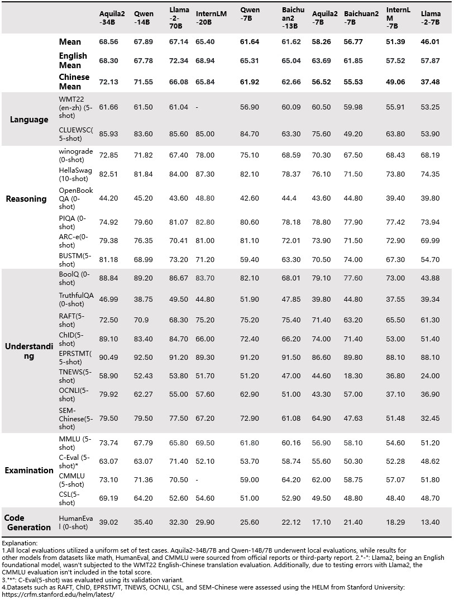
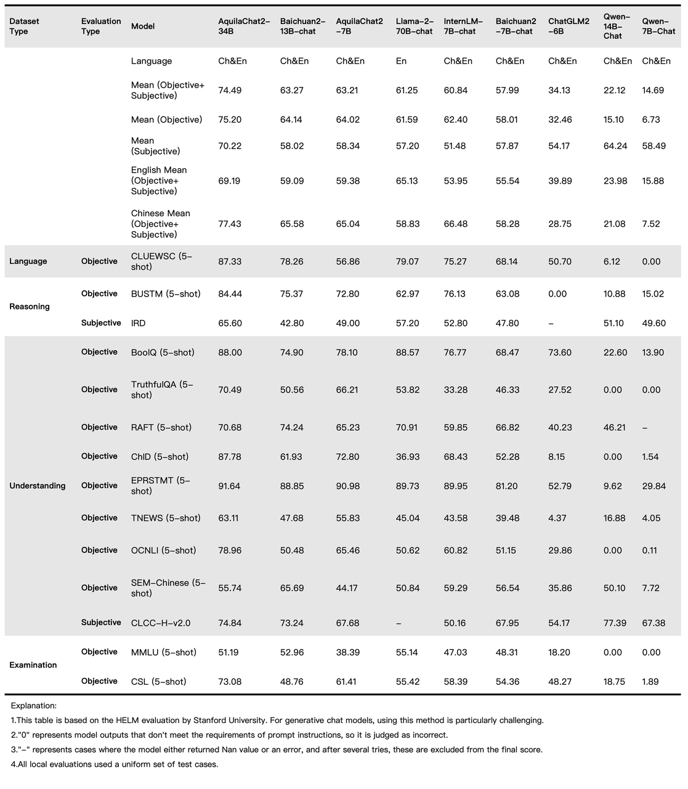

<p align="left">
    <a href="README_CN.md">中文</a>&nbsp ｜ &nbspEnglish&nbsp
</p>
<br><br>

<p align="center">
    
<p>
<br>

<p align="center">
        🤗 <a href="https://huggingface.co/BAAI">Hugging Face</a>&nbsp&nbsp | &nbsp&nbsp <a href="https://model.baai.ac.cn/models"> BAAI ModelHub</a>&nbsp&nbsp | &nbsp&nbsp <a href="assets/wechat-qrcode.png">WeChat(微信)</a>
</p>
<br>

We opensource our **Aquila2** series, now including **Aquila2**, the base language models, namely **Aquila2-7B** and **Aquila2-34B**, as well as **AquilaChat2**, the chat models, namely **AquilaChat2-7B** and **AquilaChat2-34B**.

| Model Name         | Download Sources  | 
|-------------------|:---------:|
| Aquila2-7B        | [](https://model.baai.ac.cn/model-detail/100118) 🤗|    -    | 
| AquilaChat2-7B    | [](https://model.baai.ac.cn/model-detail/100117) 🤗|    -    | 
| Aquila2-34B       | [](https://model.baai.ac.cn/model-detail/100119) 🤗|    -    | 
| AquilaChat2-34B   | [](https://model.baai.ac.cn/model-detail/100116) 🤗|    -    |

In this repo, you can figure out:

* Quickstart with Aquila2.
* Tutorials on finetuning, including full-parameter, LoRA, and Q-LoRA.
* Long-context understanding and evaluation
* License agreement

Feel free to shoot us issues (better in English so that more people can understand you)! If you would like to help us, send us pull requests with no hesitation! We are always excited about PR! 
<br><br>

## News and Updates

* 2023.10.10 🔥 We release **Aquila2-34B** and **AquilaChat2-34B** on BAAI ModelHub and Hugging Face.
<br><br>

## Performance

Aquila2 series outperform the models of similar model sizes on a series of benchmark datasets. 

### Base Model Performance

<br>
<p align="center">
    
<p>
<br>

### Chat Model Performance

<br>
<p align="center">
    
<p>
<br>

### Long Context Performance

<br>

| Model                |   Method    | Avg. | ZH-Avg. | EN-Avg. | VCSUM(zh)<br>(Chinese) | LSHT(zh)<br>(Chinese) | HotpotQA<br>(English) | 2WikiMQA<br>(English) |
| :------------------- | :---------: | :--: | :-----: | :-----: | :--------------------: | :-------------------: | :-------------------: | :-------------------: |
| GPT-3.5-Turbo-16K   |      -      | 33.6 |  44.7   |  22.6   |          16.0          |         29.2          |         51.6          |         37.7          |
| **AquilaChat2-34B-16K** |  PI + SFT   | **31.7** | **40.2** | **23.3** |          **16.5**          |         **30.0**      |         **41.9**      |         **38.5**      |
| ChatGLM2-6B-32K     |  PI + SFT   | 30.8 |  39.6   |  22.0   |          16.2          |         27.7          |         45.1          |         34.0          |
| **AquilaChat2-7B-16K**  |  PI + SFT   | **29.5** | **31.7** | **27.2** |          **14.4**          |         **40.0**      |         **36.1**      |         **27.3**      |
| InternLM-7B-8K      |      -      | 22.4 |  30.6   |  14.3   |          13.0          |         15.5          |         33.3          |         27.9          |
| ChatGLM2-6B          |    None     | 22.1 |  26.6   |  17.6   |          14.6          |         20.5          |         33.0          |         20.2          |
| LongChat-7B-v1.5-32K |  PI + SFT   | 21.7 |  26.1   |  17.4   |          14.0          |         20.8          |         31.5          |         20.6          |
| Baichuan2-7B-Chat   |    None     | 21.3 |  25.9   |  16.8   |          13.6          |         20.0          |         32.8          |         18.9          |
| **AquilaChat2-7B-NLPE** | NLPE | **17.2** | **19.8** | **14.6** |          **10.3**          |         **19.0**      |         **19.6**      |         **20.0**      |
| Internlm-20B-Chat   |    None     | 16.6 |  24.3   |   8.9   |          11.9          |          6.0          |         24.4          |         24.2          |
| Qwen-14B-Chat       | Dynamic NTK | 16.1 |  20.8   |  11.5   |          16.6          |          6.4          |         22.9          |         18.8          |
| XGen-7B-8K          |  Pre-train  | 16.0 |  21.3   |  10.8   |          1.5           |         20.0          |         14.2          |         28.3          |
| LLaMA2-7B-Chat-4K |    None     | 14.0 |  18.0   |  10.0   |          0.2           |         19.8          |         11.6          |         24.3          |
| Baichuan2-13B-Chat  |    None     | 10.5 |  14.8   |   6.3   |          7.0           |          5.5          |         16.0          |         13.6          |

<br>

### Reasoning Tasks Performance

<br>

| Model                        | Avg. | bAbI#16<br>(Inductive) | CLUTRR<br>(Inductive) | bAbI#15<br>(Deductive) | EntailmentBank<br>(Deductive) | αNLI<br>(Abductive) | E-Care<br>(Casual) |
| :--------------------------- | :--: | :--------------------: | :-------------------: | :--------------------: | :---------------------------: | :-----------------: | :----------------: |
| Baichuan2-7B-Chat            | 47.8 |          40.0          |         26.7          |          43.3          |             73.3              |        53.3         |        50.0        |
| Qwen-7B-Chat                 | 49.5 |          20.0          |         10.0          |          66.7          |             86.7              |        56.7         |        56.7        |
| Qwen-14B-Chat                | 51.1 |          26.7          |         10.0          |          63.3          |             86.7              |        63.3         |        56.7        |
| Baichuan2-13B-Chat           | 53.3 |          33.3          |         10.0          |          66.7          |             80.0              |        66.7         |        63.3        |
| InternLM-20B-Chat            | 53.9 |          46.7          |         13.3          |          43.3          |             80.0              |        70.0         |        70.0        |
| ChatGPT                      | 55.6 |          46.7          |          6.7          |          86.7          |             83.3              |        63.3         |        46.7        |
| LLaMA-70B-Chat               | 57.2 |          63.3          |         20.0          |          53.3          |             80.0              |        66.7         |        60.0        |
| GPT-4                        | 81.1 |          93.3          |         36.7          |         100.0          |             90.0              |        83.3         |        83.3        |
| **AquilaChat2-34B**         | **58.3** |          **43.3**          |         **16.7**      |          **63.6**          |             **80.0**          |        **80.0**     |        **66.7**        |
| **AquilaChat2-34B+SFT**     | **65.6** |          **73.3**          |         **16.7**      |          **76.7**          |             **80.0**          |        **76.7**     |        **70.0**        |
| **AquilaChat2-34B+SFT+CoT** | **69.4** |          **80.0**          |         **23.3**      |          **83.3**          |             **73.3**          |        **80.0**     |        **76.7**        |

<br>

## Requirements

* python 3.10 and above
* pytorch 1.12 and above, 2.0 and above are recommended
* transformers 4.32 and above
* CUDA 11.4 and above are recommended (this is for GPU users, flash-attention users, etc.)
<br><br>

## Quickstart
We have provided a straightforward example to illustrate how to quickly get started with Aquila2.

Before proceeding, ensure that your environment is properly configured and that the necessary packages have been installed. First and foremost, ensure that these prerequisites are met and then follow the instructions below to install the necessary libraries and dependencies.
```
pip install -r requirements.txt
https://github.com/FlagAI-Open/FlagAI.git
(cd FlagAI/ && python setup.py install)
```


If your device supports fp16 or bf16 precision, we also recommend installing flash-attention to enhance execution speed and reduce memory consumption. It's important to note that flash-attention is optional, and the project can be executed normally without it.

For the installation of flash-attention, please refer to https://github.com/Dao-AILab/flash-attention/.

You can also set up the environment required for Aquila2 by directly[downloading the Docker file](https://model.baai.ac.cn/model-detail/220118) and installing it.

Now you can use  BAAI Modelhub or 🤗 Transformers to run our model。

###  ModelHub

You can now utilize the AquilaChat2-7B model for inference as follows:

```python
from flagai.auto_model.auto_loader import AutoLoader

# Model name
model_name = 'AquilaChat2-7B'
# model_name = 'AquilaChat2-34B'

# Load the model and tokenizer
autoloader = AutoLoader("aquila2", model_name=model_name)
# To modify the model loading path, use the model_dir parameter
# autoloader = AutoLoader("aquila2", model_dir='./checkpoints', model_name=model_name)
# To load the LoRA module, you need to provide the path to the LoRA module
# autoloader = AutoLoader("aquila2", model_name=model_name，lora_dir='./examples/checkpoints/lora/aquila2chat')
# To load the LoRA module, you need to provide the path to the LoRA module
# autoloader = AutoLoader("aquila2", model_name=model_name，qlora_dir='./examples/checkpoints/qlora/aquila2chat')

model = autoloader.get_model()
tokenizer = autoloader.get_tokenizer()


# Example
test_data = [
    "Write a tongue twister that's extremely difficult to pronounce.",
]

for text in test_data:
    print(model.predict(text, tokenizer=tokenizer))
    # For Aquila2-7B or Aquila2-34B，you need to set sft=False
    # print(model.predict(text, tokenizer=tokenizer, sft=False))
```

The results of our execution are as follows:

```
Harry had a harpy flight, Fred had a fiddle, and George had a gecko for breakfast.  Say that three times fast and see how long you can make it last!
```

<br><br>

### 🤗 Transformers

```python
from transformers import AutoTokenizer, AutoModelForCausalLM
import torch
device = torch.device("cuda")
model_info = "BAAI/AquilaChat2-7B"
tokenizer = AutoTokenizer.from_pretrained(model_info, trust_remote_code=True)
model = AutoModelForCausalLM.from_pretrained(model_info, trust_remote_code=True)
model.eval()
model.to(device)
text = "请给出10个要到北京旅游的理由。"
tokens = tokenizer.encode_plus(text)['input_ids'][:-1]
tokens = torch.tensor(tokens)[None,].to(device)
stop_tokens = ["###", "[UNK]", "</s>"]
with torch.no_grad():
    out = model.generate(tokens, do_sample=True, max_length=512, eos_token_id=100007, bad_words_ids=[[tokenizer.encode(token)[0] for token in stop_tokens]])[0]
    out = tokenizer.decode(out.cpu().numpy().tolist())
    print(out)
```

## Quantization

Before using quantization, BitsAndBytesConfig needs to be installed:

```
pip install bitsandbytes
```

After that, you're all set to use the quantized models for inference!

### Usage

```python
import torch 
from flagai.auto_model.auto_loader import AutoLoader
from transformers import BitsAndBytesConfig

model_name = 'AquilaChat2-7B'

autoloader = AutoLoader("aquila2", model_name=model_name, 
    quantization_config=BitsAndBytesConfig(
        load_in_4bit=True,
        bnb_4bit_use_double_quant=True,
        bnb_4bit_quant_type="nf4",
        bnb_4bit_compute_dtype=torch.bfloat16,
    ))

model = autoloader.get_model()
tokenizer = autoloader.get_tokenizer()
# 

test_data = [
    "Write a tongue twister that's extremely difficult to pronounce.",
]

for text in test_data:
    print(model.predict(text, tokenizer=tokenizer))

```

### Inference Speed

We measured the average inference speed (tokens/s) of generating 2048 and 8192 tokens under BF16 precision and Int4 quantization, respectively.

| Quantization         | Speed (2048 tokens) | Speed (8192 tokens) |
|----------------------|:-------------------:|:-------------------:|
| Aquila2-34B-Chat (BF16) |        30.70        |        21.73        |
| Aquila2-34B-Chat (Int4) |        37.11        |        26.11        |

In detail, the setting of profiling is generating 8192 new tokens with 1 context token. The profiling runs on a single A100-SXM4-80G GPU with PyTorch 2.0.1 and CUDA 11.4. The inference speed is averaged over the generated 8192 tokens.

### GPU Memory Usage

We also profile the peak GPU memory usage for encoding 2048 tokens as context (and generating single token) and generating 8192 tokens (with single token as context) under BF16 or Int4 quantization level, respectively. The results are shown below.

| Quantization         | Peak Usage for Encoding 2048 Tokens | Peak Usage for Generating 8192 Tokens |
|----------------------|:-----------------------------------:|:-------------------------------------:|
| Aquila2-34B-Chat (BF16) |               30.15GB               |                38.94GB                |
| Aquila2-34B-Chat (Int4) |               13.00GB               |                21.79GB                |

<br><br>

## Pretraining

From Aquila2, we upgrade the underlying pretraining framework, which is now open-sourced as [FlagScale](https://github.com/FlagOpen/FlagScale). It is based on the Megatron-LM project and aims at utilizing the computation resources efficiently for LLMs without sacrificing the numerical stability and model effectiveness. 

In FlagScale, we firstly provide our actually used training schemes for Aquila2-7B and Aquila2-34B, including the parallel strategies, optimizations and hyper-parameter settings. By using FlagScale, our model FLOPs utilization can achieve about 58% for both Aquila2-7B and Aquila2-34B. For now, FlagScale is still in its early stage and we will work with the community together to support different LLMs on various hardware architectures in the future.

## Finetuning

### Usage
We provide users with a series of fine-tuning scripts designed to adapt models to various downstream tasks using custom data. Within the comments section of the scripts, users will find detailed instructions indicating which parameters may need adjustments based on specific needs.

Before initiating the fine-tuning process, you are required to have your training data prepared. All samples should be consolidated into a list and stored in a json file. Each sample should be represented as a dictionary, encompassing an ID and conversation, with the latter presented in list format. Below is an example for your reference:

```json
{
	"id": "alpaca_data.json_1",
	"conversations": [{
		"from": "human",
		"value": "What are the three primary colors?"
	}, {
		"from": "gpt",
		"value": "The three primary colors are red, blue, and yellow."
	}],
	"instruction": ""
}
```
Subsequently, you can utilize the variety of fine-tuning scripts we offer for different purposes:

- Execute `finetune/7B/finetune.sh` for a full parameter fine-tuning of the 7B model
- Execute `finetune/7B/finetune_lora.sh` for LoRA fine-tuning of the 7B model
- Execute `finetune/7B/finetune_qlora.sh` for Q-LoRA fine-tuning of the 7B model
- Execute `finetune/34B/finetune.sh` for a full parameter fine-tuning of the 34B model
- Execute `finetune/34B/finetune_lora.sh` for LoRA fine-tuning of the 34B model
- Execute `finetune/34B/finetune_qlora.sh` for Q-LoRA fine-tuning of the 34B model

### Optimization Effects

Below are the data on memory usage and training speed for the 7B and 34B models using full-parameter fine-tuning, LoRA, and QLoRA with different input lengths. The evaluation was conducted on a machine equipped with an A100-SXM4-80G GPU, utilizing CUDA 12.1 and Pytorch 2.1. The input length for the 7B model is 2048, and for the 34B model, it is 4096. All tests were performed using a batch size of 4 and a gradient accumulation of 1, and both memory usage (in GB) and training speed (in s/iter) were recorded. The specific data is as follows:

<table>
    <tr>
      <th>Model Size</th><th>Method</th><th>Memory</th><th>speed</th>
    </tr>
    <tr>
        <th rowspan="3">7B</th><td>SFT</td><td>43.9G</td><td>2.67s/iter</td>
    </tr>
    <tr>
        <td>LoRA</td><td>29.4G</td><td>2.04s/iter</td>
    </tr>
    <tr>
        <td>Q-LoRA</td><td>19.9G</td><td>2.14s/iter</td>
    </tr>
    <tr>
        <th rowspan="1">34B</th><td>Q-LoRA</td><td>37.7G</td><td>8.22s/iter</td>
    </tr>
</table>

<br><br>

## Web UI

Our web will be coming soon.

<br><br>

## Long-Context Understanding

To extend the context length and break the bottleneck of training sequence length, we introduce several techniques, including NTK-aware interpolation, window attention, and LogN attention scaling.

<br><br>

## Tokenizer

Our tokenizer of BBPE type is trained on a 50GB text dataset, mainly sampled from deduplicated Pile and WuDao corpus. We also add some special tokens for passage and conversation separation.
<br><br>

## FAQ

You're welcome to submit your questions or share your user experience in [GitHub Issues](https://github.com/FlagAI-Open/Aquila2/issues) .
<br><br>

## License Agreement

<br><br>

## Contact Us

If you are interested, please join our WeChat groups!


<br><br>
