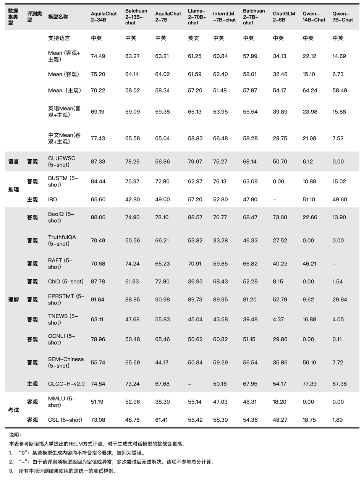

<p align="left">
        中文</a>&nbsp ｜ &nbsp<a href="README.md">English</a>
</p>
<br><br>

<p align="center">
    
<p>
<br>

<p align="center">
        🤗 <a href="https://huggingface.co/BAAI">Hugging Face</a>&nbsp&nbsp | &nbsp&nbsp <a href="https://model.baai.ac.cn/models"> BAAI ModelHub</a>&nbsp&nbsp | &nbsp&nbsp <a href="assets/wechat-qrcode.jpg">微信</a>
</p>
<br><br>

我们开源了我们的 **Aquila2** 系列，现在包括基础语言模型 **Aquila2-7B** 和 **Aquila2-34B** ，对话模型 **AquilaChat2-7B** 和 **AquilaChat2-34B**，长文本对话模型**AquilaChat2-7B-16k** 和 **AquilaChat2-34B-16k**，您可以通过点击下方图标进入下载界面：

| 模型名称           | 下载方式  |
|-------------------|:---------:|
| Aquila2-7B        | [](https://model.baai.ac.cn/model-detail/100118) [🤗](https://huggingface.co/BAAI/Aquila2-7B)|    -    | 
| AquilaChat2-7B    | [](https://model.baai.ac.cn/model-detail/100117) [🤗](https://huggingface.co/BAAI/AquilaChat2-7B)|    -    | 
| AquilaChat2-7B-16k    | [](https://model.baai.ac.cn/model-detail/100120) |    -    | 
| Aquila2-34B       | [](https://model.baai.ac.cn/model-detail/100119) |    -    | 
| AquilaChat2-34B   | [](https://model.baai.ac.cn/model-detail/100116) [🤗](https://huggingface.co/BAAI/AquilaChat2-34B)|    -    |
| AquilaChat2-34B-16k    | [](https://model.baai.ac.cn/model-detail/100121) |    -    |


在这个仓库中，您可以：

* 快速开始使用 Aquila2，进行简单的推理。
* 有关量化模型的详细信息，包括使用方法、内存、推理速度。
* 微调教程，包括全参数、LoRA 和 Q-LoRA。
* 长文本理解与评估
* 许可协议

欢迎对我们提出任何问题（建议用英语，这样更多人会明白你的问题哦）！如果有兴趣帮我们改进 **Aquila2**，可以提交你的Pull Requests， 我们会及时处理。

如果你想与我们进行讨论和交流，请尽快加入我们的微信群吧(请参见文档顶部以获取入口信息)！


<br>

## 更新

* 2023.10.10 🔥 我们在 ModelHub 和 Hugging Face 上发布了 **Aquila2-34B** 和 **AquilaChat2-34B**。

## 评测表现

Aquila2-34B和Aquila2-7B相比同规模的基线模型在各项评测数据集上均表现更优。

### 基础模型表现
<br>
<p align="center">
    
<p>
<br>

### 对话模型表现

<br>
<p align="center">
    
<p>
<p>
    <b>评测说明：</b>
    <br>
    对于生成式对话模型，智源团队认为需要严格按照“模型在问题输入下自由生成的答案”进行评判，这种方式贴近用户真实使用场景，因此参考斯坦福大学HELM[1]工作进行评测，该评测对于模型的上下文学习和指令跟随能力要求更为严格。实际评测过程中，部分对话模型回答不符合指令要求，可能会出现“0”分的情况。例如：根据指令要求，正确答案为“A”，如果模型生成为“B”或“答案是 A ”，都会被判为“0”分。同时，业内也有其他评测方式，比如让对话模型先拼接“问题+答案”，模型计算各个拼接文本的概率后，验证概率最高的答案与正确答案是否一致，评测过程中对话模型不会生成任何内容而是计算选项概率。这种评测方式与真实对话场景偏差较大，因此在生成式对话模型评测中没有采纳。
    <br>
    [1] https://crfm.stanford.edu/helm/latest
</p>
	
<br>


### 长文本任务表现

<br>

| Model                |   Method    | Avg. | ZH-Avg. | EN-Avg. | VCSUM(zh)<br>(Chinese) | LSHT(zh)<br>(Chinese) | HotpotQA<br>(English) | 2WikiMQA<br>(English) |
| :------------------- | :---------: | :--: | :-----: | :-----: | :--------------------: | :-------------------: | :-------------------: | :-------------------: |
| GPT-3.5-Turbo-16K   |      -      | 33.6 |  44.7   |  22.6   |          16.0          |         29.2          |         51.6          |         37.7          |
| **AquilaChat2-34B-16K** |  PI + SFT   | 31.7 |  40.2   |  23.3   |          16.5          |         30.0          |         41.9          |         38.5          |
| ChatGLM2-6B-32K     |  PI + SFT   | 30.8 |  39.6   |  22.0   |          16.2          |         27.7          |         45.1          |         34.0          |
| **AquilaChat2-7B-16K**  |  PI + SFT   | 29.5 |  31.7   |  27.2   |          14.4          |         40.0          |         36.1          |         27.3          |
| InternLM-7B-8K      |      -      | 22.4 |  30.6   |  14.3   |          13.0          |         15.5          |         33.3          |         27.9          |
| ChatGLM2-6B          |    None     | 22.1 |  26.6   |  17.6   |          14.6          |         20.5          |         33.0          |         20.2          |
| LongChat-7B-v1.5-32K |  PI + SFT   | 21.7 |  26.1   |  17.4   |          14.0          |         20.8          |         31.5          |         20.6          |
| Baichuan2-7B-Chat   |    None     | 21.3 |  25.9   |  16.8   |          13.6          |         20.0          |         32.8          |         18.9          |
| Internlm-20B-Chat   |    None     | 16.6 |  24.3   |   8.9   |          11.9          |          6.0          |         24.4          |         24.2          |
| Qwen-14B-Chat       | Dynamic NTK | 16.1 |  20.8   |  11.5   |          16.6          |          6.4          |         22.9          |         18.8          |
| XGen-7B-8K          |  Pre-train  | 16.0 |  21.3   |  10.8   |          1.5           |         20.0          |         14.2          |         28.3          |
| LLaMA2-7B-Chat-4K |    None     | 14.0 |  18.0   |  10.0   |          0.2           |         19.8          |         11.6          |         24.3          |
| Baichuan2-13B-Chat  |    None     | 10.5 |  14.8   |   6.3   |          7.0           |          5.5          |         16.0          |         13.6          |

<br>

### 推理任务表现

<br>

| Model                        | Avg. | bAbI#16<br>(Inductive) | CLUTRR<br>(Inductive) | bAbI#15<br>(Deductive) | EntailmentBank<br>(Deductive) | αNLI<br>(Abductive) | E-Care<br>(Casual) |
| :--------------------------- | :--: | :--------------------: | :-------------------: | :--------------------: | :---------------------------: | :-----------------: | :----------------: |
| Baichuan2-7B-Chat            | 47.8 |          40.0          |         26.7          |          43.3          |             73.3              |        53.3         |        50.0        |
| Qwen-7B-Chat                 | 49.5 |          20.0          |         10.0          |          66.7          |             86.7              |        56.7         |        56.7        |
| Qwen-14B-Chat                | 51.1 |          26.7          |         10.0          |          63.3          |             86.7              |        63.3         |        56.7        |
| Baichuan2-13B-Chat           | 53.3 |          33.3          |         10.0          |          66.7          |             80.0              |        66.7         |        63.3        |
| InternLM-20B-Chat            | 53.9 |          46.7          |         13.3          |          43.3          |             80.0              |        70.0         |        70.0        |
| ChatGPT                      | 55.6 |          46.7          |          6.7          |          86.7          |             83.3              |        63.3         |        46.7        |
| LLaMA-70B-Chat               | 57.2 |          63.3          |         20.0          |          53.3          |             80.0              |        66.7         |        60.0        |
| GPT-4                        | 81.1 |          93.3          |         36.7          |         100.0          |             90.0              |        83.3         |        83.3        |
| **AquilaChat2-34B**         | 58.3 |          43.3          |         16.7          |          63.6          |             80.0              |        80.0         |        66.7        |
| **AquilaChat2-34B+SFT**     | 65.6 |          73.3          |         16.7          |          76.7          |             80.0              |        76.7         |        70.0        |
| **AquilaChat2-34B+SFT+CoT** | 69.4 |          80.0          |         23.3          |          83.3          |             73.3              |        80.0         |        76.7        |

<br>

## 安装环境

* python 版本 >= 3.10 
* pytorch 版本 >= 1.12, 建议2.0版本及以上
* transformers 版本 >= 4.32
* CUDA 版本 >= 11.4 (GPU用户、flash-attention用户等需考虑此选项)

<br>

## 快速使用

我们为您展示了一个简单的示例, 来演示如何快速上手Aquila2.

在您动手操作之前，请确认您已经设置好了运行环境，并成功安装了必要的代码包。首先，请确保满足这些先决条件，然后按照下面的指示安装必要的库和依赖。


```
pip install -r requirements.txt
https://github.com/FlagAI-Open/FlagAI.git
(cd FlagAI/ && python setup.py install)
```

如果您的显卡兼容 fp16 或 bf16 精度，我们还建议您安装 flash-attention，以增加运行速度和减少显存使用。请注意，flash-attention 不是必须的，没有它您也能正常执行该项目。

flash-attention安装：参考 https://github.com/Dao-AILab/flash-attention/

### 使用镜像TAR文件
除了以上这些，您也可以通过直接[下载docker文件](https://model.baai.ac.cn/model-detail/220118)并安装来配置Aquila2所需的环境。

现在可以开始使用  Modelhub 或 🤗Transformers 来运行我们的模型。


###  ModelHub

要使用 Aquila2-Chat 进行推理，你只需要输入下面演示的几行代码。

```python
from flagai.auto_model.auto_loader import AutoLoader


# 模型名称
model_name = 'AquilaChat2-7B'
# model_name = 'AquilaChat2-34B'

# 加载模型以及tokenizer
autoloader = AutoLoader("aquila2", model_name=model_name)
# 使用model_dir参数调整模型加载路径
# autoloader = AutoLoader("aquila2", model_dir='./checkpoints', model_name=model_name)
# 如需加载LoRA模块，需要额外提供LoRA模块的地址
# autoloader = AutoLoader("aquila2", model_name=model_name，lora_dir='./examples/checkpoints/lora/aquila2chat-hf')
# 如需加载Q-LoRA模块，需要额外提供Q-LoRA模块的地址
# autoloader = AutoLoader("aquila2", model_name=model_name，qlora_dir='./examples/checkpoints/qlora/aquila2chat-hf')

model = autoloader.get_model()
tokenizer = autoloader.get_tokenizer()


# 对话测试样例
test_data = [
    "北京的十大景点是什么?",
    "写一首中秋主题的五言绝句",
]

for text in test_data:
    print(model.predict(text, tokenizer=tokenizer, model_name=model_name))
    # 如果是基础模型Aquila2-7B或者Aquila2-34B，需要设置 sft=False
    # print(model.predict(text, tokenizer=tokenizer, model_name=model_name, sft=False))
```

我们运行的结果如下:
```
北京十大景点: 1. 天安门广场 2. 故宫 3. 颐和园 4. 天坛 5. 鸟巢 6. 北京大学 7. 清华大学 8. 北京动物园 9. 北京植物园 10. 长城。

皎洁月光洒九洲，团圆佳节倍思悠。
```


### 🤗 Transformers

```python
from transformers import AutoTokenizer, AutoModelForCausalLM
import torch
device = torch.device("cuda")
model_info = "BAAI/AquilaChat2-7B"
tokenizer = AutoTokenizer.from_pretrained(model_info, trust_remote_code=True)
model = AutoModelForCausalLM.from_pretrained(model_info, trust_remote_code=True)
model.eval()
model.to(device)
text = "请给出10个要到北京旅游的理由。"
tokens = tokenizer.encode_plus(text)['input_ids']
tokens = torch.tensor(tokens)[None,].to(device)
stop_tokens = ["###", "[UNK]", "</s>"]
with torch.no_grad():
    out = model.generate(tokens, do_sample=True, max_length=512, eos_token_id=100007, bad_words_ids=[[tokenizer.encode(token)[0] for token in stop_tokens]])[0]
    out = tokenizer.decode(out.cpu().numpy().tolist())
    print(out)
```

## 量化

### 用法

使用量化之前，需要安装`BitsAndBytesConfig`：

```
pip install bitsandbytes
```

接下来就可以使用量化模型进行推理啦！

```python
import torch 
from flagai.auto_model.auto_loader import AutoLoader
from transformers import BitsAndBytesConfig


model_name = 'AquilaChat2-7B'

autoloader = AutoLoader("aquila2", model_name=model_name, 
    quantization_config=BitsAndBytesConfig(
        load_in_4bit=True,
        bnb_4bit_use_double_quant=True,
        bnb_4bit_quant_type="nf4",
        bnb_4bit_compute_dtype=torch.bfloat16,
    ))

model = autoloader.get_model()
tokenizer = autoloader.get_tokenizer()
# 

test_data = [
    "北京的十大景点是什么?",
    "写一首中秋主题的五言绝句",
    "Write a tongue twister that's extremely difficult to pronounce.",
]

for text in test_data:
    print(model.predict(text, tokenizer=tokenizer, model_name=model_name))

```

<br><br>

## 微调

我们为用户提供了一系列微调脚本，用于在自定义数据上微调模型，以适应不同的下游任务。在脚本的注释部分，用户会找到详细的说明，指明哪些参数需要根据实际需求进行调整。

在进行微调操作之前，您必须先准备好您的训练数据。所有样本需要集中到一个列表中，并存储在一个 json 文件里。每个样本应表现为一个字典，包括 id 和 conversation，其中，conversation 以列表的形式展现。以下提供了一个示例：

```json
{
	"id": "alpaca_data.json_1",
	"conversations": [{
		"from": "human",
		"value": "What are the three primary colors?"
	}, {
		"from": "gpt",
		"value": "The three primary colors are red, blue, and yellow."
	}],
	"instruction": ""
}
```

然后您可以使用我们提供不同的微调脚本实现不同功能：
- 使用`finetune/7B/finetune.sh`实现7B模型全参数微调 
- 使用`finetune/7B/finetune_lora.sh`实现7B模型LoRA微调 
- 使用`finetune/7B/finetune_qlora.sh`实现7B模型Q-LoRA微调 
- 使用`finetune/34B/finetune.sh`实现34B模型全参数微调 
- 使用`finetune/34B/finetune_lora.sh`实现34B模型LoRA微调 
- 使用`finetune/34B/finetune_qlora.sh`实现34B模型Q-LoRA微调 

Note that you are required to specify the path to the training data within the script, and configure the hostfile accordingly. If a custom model file is not provided in the script, it will automatically download the corresponding model from ModelHub based on the specified model name and proceed with the fine-tuning operation.


To perform full-parameter fine-tuning, execute the following scripts:

```bash
# Fine-tuning the 7B model
bash finetune/7B/finetune.sh
# Fine-tuning the 34B model
bash finetune/34B/finetune.sh
```

The fine-tuning approach of LoRA (as detailed in the [paper](https://arxiv.org/abs/2106.09685)) varies from the full-parameter method. LoRA solely updates the parameters of the adapter layer without modifying the original language model parameters. This practice reduces memory and computational overhead. Applicable to a variety of model sizes and tasks, LoRA facilitates more efficient model fine-tuning to cater to specific tasks or datasets.

To implement LoRA, execute the following scripts:

```bash
# 微调7B模型
bash finetune/7B/finetune_lora.sh
# 微调34B模型
bash finetune/34B/finetune_lora.sh
```

If memory resources remain constrained, consider employing Q-LoRA (refer to the [paper](https://arxiv.org/abs/2305.14314)), an optimized solution that further reduces memory usage through the utilization of 4-bit quantized models and paged attention techniques.

To implement Q-LoRA, execute the following scripts:

```bash
# 微调7B模型
bash finetune/7B/finetune_qlora.sh
# 微调34B模型
bash finetune/34B/finetune_qlora.sh
```


### 优化效果

以下是7B和34B模型使用全参数微调，LoRA 和 QLoRA 处理不同输入长度时的显存占用和训练速度的数据。评测是在一台装备有 A100-SXM4-80G GPU 的机器上进行，使用 CUDA 12.1 和 Pytorch 2.1。其中7B模型的输入长度为2048， 34B模型的输入长度为4096。我们进行的所有测试均采用了批次大小为 4 和梯度累积为 1 的配置，并且记录了以GB为单位的显存占用和以s/iter为单位的训练速度。具体的数据如下：

<table>
    <tr>
      <th>模型大小</th><th>微调方法</th><th>显存占用</th><th>训练速度</th>
    </tr>
    <tr>
        <th rowspan="3">7B</th><td>SFT</td><td>43.9G</td><td>2.67s/iter</td>
    </tr>
    <tr>
        <td>LoRA</td><td>29.4G</td><td>2.04s/iter</td>
    </tr>
    <tr>
        <td>Q-LoRA</td><td>19.9G</td><td>2.14s/iter</td>
    </tr>
    <tr>
        <th rowspan="1">34B</th><td>Q-LoRA</td><td>37.7G</td><td>8.22s/iter</td>
    </tr>
</table>


<br><br>

## 预训练
从Aquila2开始，我们升级了底层的预训练框架，现在以[FlagScale](https://github.com/FlagOpen/FlagScale)项目进行开源。目前，它基于Megatron-LM项目，旨在在不牺牲数值稳定性和模型有效性的前提下，高效利用计算资源来训练大型语言模型（LLMs）。

在FlagScale中，我们率先提供了实际训练中使用的Aquila2-7B和Aquila2-34B的训练方案，包括并行策略、优化选择和超参数设置。通过使用FlagScale，模型FLOPs利用率在Aquila2-7B和Aquila2-34B上均可达到很高水平。目前，FlagScale仍处于早期阶段，我们将与社区共同努力，以在不同的硬件架构上支持各种LLMs。


## 长文本处理
AquilaChat2-34B-16K以Aquila2-34B为基座，经过位置编码内插法处理，并在20W条优质长文本对话数据集上做了SFT，将模型的有效上下文窗口长度扩展至16K。我们在[LongBench](https://github.com/THUDM/LongBench)上测试了四项中英文长文本问答、总结任务。评测效果显示，AquilaChat2-34B-16K处于开源长文本模型的领先水平，接近 GPT-3.5-16k。
### 用法


## Tokenizer

我们的 tokenizer 是 50G 大小数据集上训练得到的 BBPE 类型 tokenizer。数据集主要从去重后的Pile和悟道数据集抽样得到。

<br><br>

## FAQ

欢迎在 [GitHub Issues](https://github.com/FlagAI-Open/Aquila2/issues) 中提出你的问题或交流使用经验。
<br><br>

## 使用协议

Aquila2项目基于 [Apache 2.0 license](https://www.apache.org/licenses/LICENSE-2.0) 协议；Aquila2系列模型则是基于[智源Aquila系列模型许可协议](./assets/aquila_license.pdf)。

<br><br>

## 联系我们

* 官方邮箱：open.platform@baai.ac.cn。
* 知乎：[FlagAI飞智](https://www.zhihu.com/people/95-22-20-18)
* 扫码添加小助手加入**微信交流群**：


