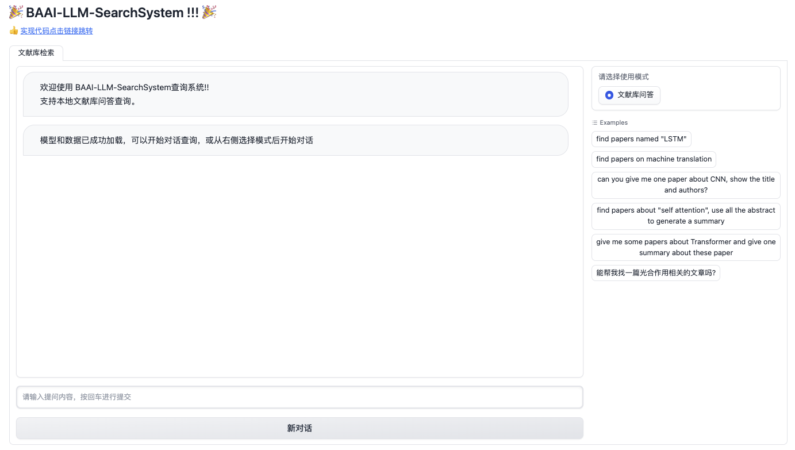

## 介绍
这是一个基于BAAI研发的大语言模型Aquilachat2和向量化检索模型BGE的本地知识库问答的应用。本项目的实现原理如下图所示，包括读取文本 -> 文本向量化（BGE）和构建向量库 -> 查询语句向量化 -> 匹配出与查询语句向量最相似的top M个文档 -> 将匹配的文档和查询语句组合构成prompt -> 提交给Aquilachat2生成回答。


## 安装环境
* python 版本 >= 3.10
* pytorch 版本 >= 2.0.1
* transformers 版本 >= 4.32.1
* CUDA 版本 >= 11.4 (GPU用户、flash-attention用户等需考虑此选项)

## 快速使用

### 1.环境配置

对于满足这个要求的环境，您可以通过直接下载[docker](https://model.baai.ac.cn/model-detail/220119)文件并安装来配置所需的环境。由于所有已安装的依赖项，在容器中您只需拉取源[FlagAI](https://github.com/FlagAI-Open/FlagAI.git)，将路径添加到环境变量中export PYTHONPATH=$FLAGAI_HOME:$PYTHONPATH。

### 2.数据准备

我们提供了一些示例数据，可见于data_demo.json。您可根据自己的实际情况更换自己的数据。

### 3.模型下载

若实现在本地或离线环境下运行项目，需要首先将项目所需的模型下载至本地。本项目中默认使用的LLM模型[Aquilachat2-34B](https://model.baai.ac.cn/models)与Embedding模型[BGE](https://huggingface.co/BAAI/bge-large-en-v1.5),[BGE-reranker](https://huggingface.co/BAAI/bge-reranker-large) 。

### 4.构建本地知识库

数据预处理，包括：对data_demo.json进行过滤，生成abstract和meta的embedding，生成abstract和meta的BM25 index。执行以下命令：

```bash
cd BGE
./preproces.sh
```

### 5.LLM微调

具体过程请参考https://github.com/FlagAI-Open/Aquila2/ 。

### 6.一键启动

```python
cd Aquila_local_search
CUDA_VISIBLE_DEVICES=0 python local_search.py
```
### 7.启动界面示例
本地端口设置为9172。如果正常启动，您将看到以下界面：


