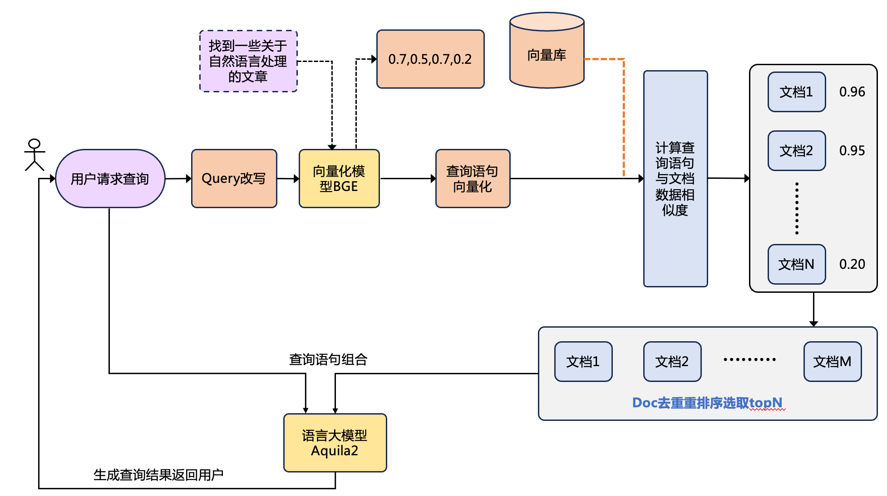
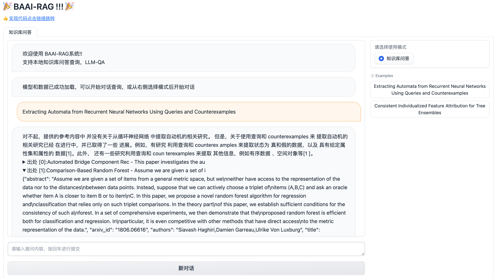

## 介绍
这是一个基于BAAI研发的大语言模型Aquilachat2和向量化检索模型BGE的本地知识库问答的应用。本项目的实现原理如下图所示，包括读取文本 --> 查询语句改写 -> 文本向量化（BGE）和构建向量库 -> 查询语句向量化 -> 多query召回并匹配出与查询语句向量最相似的top M个文档 -> 将匹配的文档和查询语句组合构成prompt -> 提交给Aquilachat2生成回答。



## 安装环境
* python 版本 >= 3.10
* pytorch 版本 >= 2.0.1
* transformers 版本 >= 4.32.1
* CUDA 版本 >= 11.4 (GPU用户、flash-attention用户等需考虑此选项)

## 快速使用

### 1.环境配置

- 强烈建议使用docker：https://model.baai.ac.cn/model-detail/220119 准备好docker后，直接下载[FlagAI](https://github.com/FlagAI-Open/FlagAI.git)，将路径添加到环境变量中`export PYTHONPATH=$FLAGAI_HOME:$PYTHONPATH`

### 2.数据准备

我们提供了一些示例数据，可见于[data_demo.jsonl](./models/bge/knowledge_data/data_demo.jsonl)。您可根据自己的实际情况更换自己的数据。

NOTE: 如果数据格式更改，需要在数据处理脚本中进行相应的修改

### 3.模型下载

若实现在本地或离线环境下运行项目，需要首先将项目所需的模型下载至本地。本项目中默认使用的LLM模型
- LLM模型（根据硬件选择34b或者7b）
  - [Aquilachat2-34B](https://model.baai.ac.cn/model-detail/100116)
  - [AquilaChat2-7B](https://model.baai.ac.cn/model-detail/100117)

- Embedding模型（根据场景选择en-1.5或者zh-1.5或者更新的模型）
  - [bge-large-en-v1.5](https://huggingface.co/BAAI/bge-large-en-v1.5)
  - [bge-large-zh-v1.5](https://huggingface.co/BAAI/bge-large-zh-v1.5)
  - [bge-reranker-large](https://huggingface.co/BAAI/bge-reranker-large)

**模型准备完成之后，修改配置文件**

- utils/model_config.py 全局配置
- models/bge/configs_constants.py bge运行服务配置


### 4.构建本地知识库

数据预处理，包括：
1. 对`data_demo.jsonl`进行过滤
2. 生成abstract和meta的embedding
3. 生成abstract和meta的BM25 index

执行以下命令进行数据处理：

```bash
cd models/bge
bash preprocess.sh > knowledge_data/run.log
```

运行完之后会在`knowledge_data/run.log`中保存运行记录


### 5.LLM微调[若需要]

- **如果不进行微调，直接使用开源模型 【这一步跳过】**
- 如果要对LLM进行微调，具体过程请参考https://github.com/FlagAI-Open/Aquila2/

### 6.启动服务

NOTE: 从工程化角度，将向量检索与整个rag-pipeline进行解耦，运行分为两步

1. 启动向量检索服务

```python
python3 models/bge/app.py
```
服务默认端口为`5678`，在`models/bge/app.py`配置

2. 启动rag_pipelin

```python
python3 rag_pipe.py
```

### 7.启动界面示例

本地端口设置为9988。如果正常启动，您将看到以下界面：


